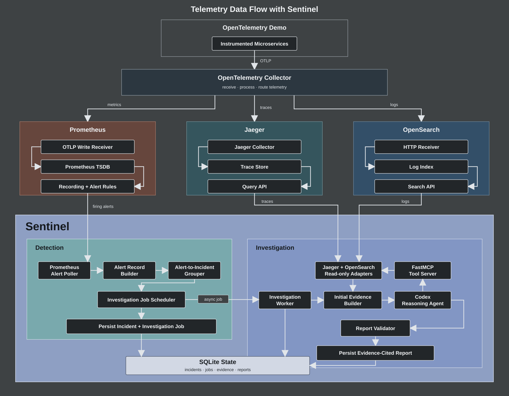

# Sentinel

Sentinel is an automated incident-detection system for distributed applications.
This first pass monitors operation-level RED signals in Prometheus from both the
server and client perspectives, consumes firing Prometheus alerts, groups
concurrent signals around the affected service, and persists incident lifecycles
in SQLite. Its investigation path collects related traces and logs, then gives a
read-only Codex agent bounded telemetry tools to produce an evidence-cited report.



## Detection path

```text
OpenTelemetry Demo
        |
        v
Prometheus span metrics
        |
        v
server-operation and client-dependency RED recording rules
        |
        v
fixed and rolling PromQL alerts
        |
        v
Sentinel Prometheus alert source
        |
        v
affected-service incident grouping
        |
        v
SQLite incident history
        |
        v
quiet-period investigation job
        |
        v
Jaeger traces + OpenSearch logs
        |
        v
Codex investigator with read-only MCP tools
        |
        v
evidence-cited report
```

Prometheus performs the numerical detection. Server signals retain
`service_name + span_name`. Client signals retain
`caller service + dependency + span_name`; client failures are grouped around
the dependency. Sentinel owns alert consumption, grouping, durable incident
state, telemetry retrieval, agent orchestration, and report validation.

## Telemetry contract

Detection quality is bounded by the coverage and granularity of the input
telemetry. Sentinel intentionally keeps operation identity instead of reducing
all traffic to one service-wide ratio. Its OTel Demo integration adds a bounded
`sentinel.dependency.name` dimension to known client spans and caps span-metric
cardinality at 10,000 combinations. Unknown or dynamic destinations are not
guessed from raw addresses.

Service-wide views remain derivable from the raw counters and histograms, but
they are not the primary detection scope. An unavailable service may emit no
server spans at all, so client dependency failures supply the caller's view of
an unreachable service. A service with no incoming traffic still requires an
independent availability or health signal, which is outside this first pass.

## Local CLI

Sentinel requires Python 3.10 or newer. Investigation uses FastMCP and the Codex
Python SDK; Codex authentication is configured separately at deployment time.

The `src/` directory is mapped directly to the `sentinel` Python package in
`pyproject.toml`. This keeps the repository layout flat while preserving normal
imports such as `from sentinel.telemetry import PrometheusAdapter`.

```bash
cp configs/local.example.json configs/local.json
python3 -m venv .venv
source .venv/bin/activate
python -m pip install -e .
```

Available commands:

```bash
sentinel --config configs/local.json check
sentinel --config configs/local.json metrics snapshot
sentinel --config configs/local.json alerts list
sentinel --config configs/local.json detect --once
sentinel --config configs/local.json detect
sentinel --config configs/local.json incidents list
sentinel --config configs/local.json incidents show INC-XXXXXXXXXXXX
sentinel --config configs/local.json investigations list
sentinel --config configs/local.json investigations show JOB-XXXXXXXXXXXX
sentinel --config configs/local.json investigations run JOB-XXXXXXXXXXXX
sentinel --config configs/local.json investigations worker
```

## Incident policy

- Only firing Prometheus alerts labeled `sentinel="true"` enter Sentinel.
- Multiple active signals for one affected service belong to one open incident.
- Server-operation alerts identify the server service as affected.
- Client-dependency alerts identify the dependency as affected while retaining
  the caller and operation in the trigger labels.
- Different services remain separate incidents in this first pass.
- Repeated polls update existing triggers instead of creating duplicates.
- A trigger becomes inactive after two successful polls in which it is absent.
- An incident resolves after all of its triggers become inactive.
- Failed Prometheus requests never advance incident recovery.
- A new trigger fingerprint creates or postpones one pending investigation job.
- Repeated value updates do not postpone the job.
- Investigation starts after 120 quiet seconds or at a five-minute hard deadline.
- Late triggers do not automatically restart a completed or running investigation
  in the MVP.

## Investigation boundary

- Initial context contains the exact alert set at the recorded cutoff, candidate
  Jaeger traces, trace-correlated logs, and a small warning/error log sample.
- The model can request more context only through bounded, read-only MCP tools.
- Every retrieved item receives an evidence ID (`D`, `M`, `T`, or `L`).
- Reports distinguish observations, hypotheses, and unknowns. Unknown evidence
  citations are rejected before persistence.
- One image runs as two processes: the existing `sentinel` detector and the
  optional `sentinel-investigator` worker. They share the SQLite data volume.

## OpenTelemetry Demo

The integration files are stored in
[`integration/otel-demo`](integration/otel-demo/README.md). They leave the
adjacent upstream demo checkout unchanged while mounting Sentinel's Prometheus
configuration and rules and adding the Sentinel service through a Compose
override.

## Tests

```bash
python -m unittest discover -s tests -v
```
